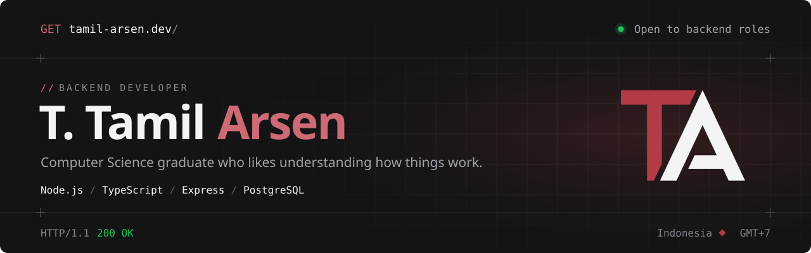

<a href="https://tamil-arsen.dev">
  <picture>
    <source media="(prefers-color-scheme: dark)" srcset="./assets/header-dark.svg" />
    <source media="(prefers-color-scheme: light)" srcset="./assets/header-light.svg" />
    
  </picture>
</a>

<br />

`// ABOUT`

I'm a backend developer from Indonesia and a Computer Science graduate. I like computers, software, and understanding how things work — which is what pulls me to the backend, where most of it happens out of sight.

**→ [tamil-arsen.dev](https://tamil-arsen.dev)** — projects, writing, and what I'm doing [now](https://tamil-arsen.dev/now).

<br />

`// STACK`

| | |
| :-- | :-- |
| **Backend** | Node.js · Express · TypeScript · PostgreSQL |
| **Also** | JavaScript · Next.js · React · Tailwind CSS |
| **On the side** | C++ — algorithms, and drawing them with SFML |

<br />

`// HOW I THINK ABOUT A SYSTEM`

```text
What problem are we actually solving?
What are the system's responsibilities?
Where should a rule live?
What must always be true?
What happens when something fails?
What trade-offs does the design introduce?
```

<br />

`// ELSEWHERE`

[tamil-arsen.dev](https://tamil-arsen.dev) &nbsp;/&nbsp; [LinkedIn](https://www.linkedin.com/in/tamilarsen-dev/) &nbsp;/&nbsp; [Codewars](https://www.codewars.com/users/tamilarsen-dev) &nbsp;/&nbsp; [tamilarsen88@gmail.com](mailto:tamilarsen88@gmail.com)

<br />

<sub><code>HTTP/1.1 200 OK</code></sub>
