<!-- Every card is a self-made SVG in ./assets (dark + light, follows your
     GitHub theme). GitHub strips CSS/JS from READMEs, so motion lives inside
     the SVGs; prefers-reduced-motion is respected. -->

<a href="https://tamil-arsen.dev">
<picture>
  <source media="(prefers-color-scheme: dark)" srcset="./assets/header-dark.svg" />
  <source media="(prefers-color-scheme: light)" srcset="./assets/header-light.svg" />
  
</picture>
</a>

<a href="https://tamil-arsen.dev">
<picture>
  <source media="(prefers-color-scheme: dark)" srcset="./assets/about-dark.svg" />
  <source media="(prefers-color-scheme: light)" srcset="./assets/about-light.svg" />
  
</picture>
</a>

<picture>
  <source media="(prefers-color-scheme: dark)" srcset="./assets/stack-dark.svg" />
  <source media="(prefers-color-scheme: light)" srcset="./assets/stack-light.svg" />
  
</picture>

<picture>
  <source media="(prefers-color-scheme: dark)" srcset="./assets/principles-dark.svg" />
  <source media="(prefers-color-scheme: light)" srcset="./assets/principles-light.svg" />
  
</picture>

<a href="https://tamil-arsen.dev"><picture>
  <source media="(prefers-color-scheme: dark)" srcset="./assets/link-site-dark.svg" />
  <source media="(prefers-color-scheme: light)" srcset="./assets/link-site-light.svg" />
  
</picture></a>
<a href="https://www.linkedin.com/in/tamilarsen-dev/"><picture>
  <source media="(prefers-color-scheme: dark)" srcset="./assets/link-linkedin-dark.svg" />
  <source media="(prefers-color-scheme: light)" srcset="./assets/link-linkedin-light.svg" />
  
</picture></a>
<a href="https://www.codewars.com/users/tamilarsen-dev"><picture>
  <source media="(prefers-color-scheme: dark)" srcset="./assets/link-codewars-dark.svg" />
  <source media="(prefers-color-scheme: light)" srcset="./assets/link-codewars-light.svg" />
  
</picture></a>
<a href="mailto:tamilarsen88@gmail.com"><picture>
  <source media="(prefers-color-scheme: dark)" srcset="./assets/link-email-dark.svg" />
  <source media="(prefers-color-scheme: light)" srcset="./assets/link-email-light.svg" />
  
</picture></a>

<picture>
  <source media="(prefers-color-scheme: dark)" srcset="./assets/footer-dark.svg" />
  <source media="(prefers-color-scheme: light)" srcset="./assets/footer-light.svg" />
  
</picture>
